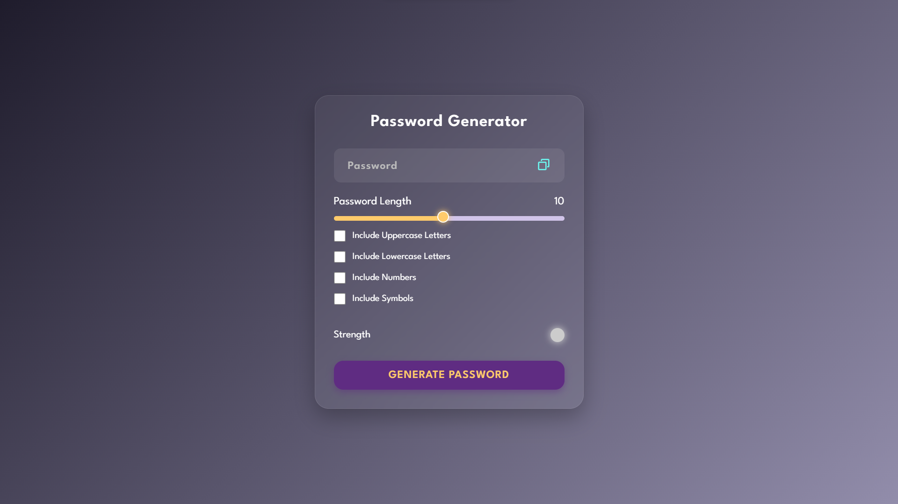

# 🔐 Password Generator

A sleek and customizable **Password Generator** built using **HTML**, **CSS**, and **JavaScript**. Generate strong and secure passwords with ease, based on your selected preferences.

 <!-- Add your UI screenshot here -->

---

## 🚀 Features

- 🎚 Adjustable password length (1 to 20)
- 🔠 Include uppercase letters
- 🔡 Include lowercase letters
- 🔢 Include numbers
- 🔣 Include symbols
- ✅ Password strength indicator (Weak, Medium, Strong)
- 📋 One-click copy to clipboard
- 💡 Smooth and modern UI/UX design

---

## 🛠 Tech Stack

- HTML5
- CSS3 (Custom Variables + Styling)
- Vanilla JavaScript (ES6)

---

## 📷 Preview

> Add a live preview GIF or image here  
> Example:  
> 

---

## 📂 Folder Structure

